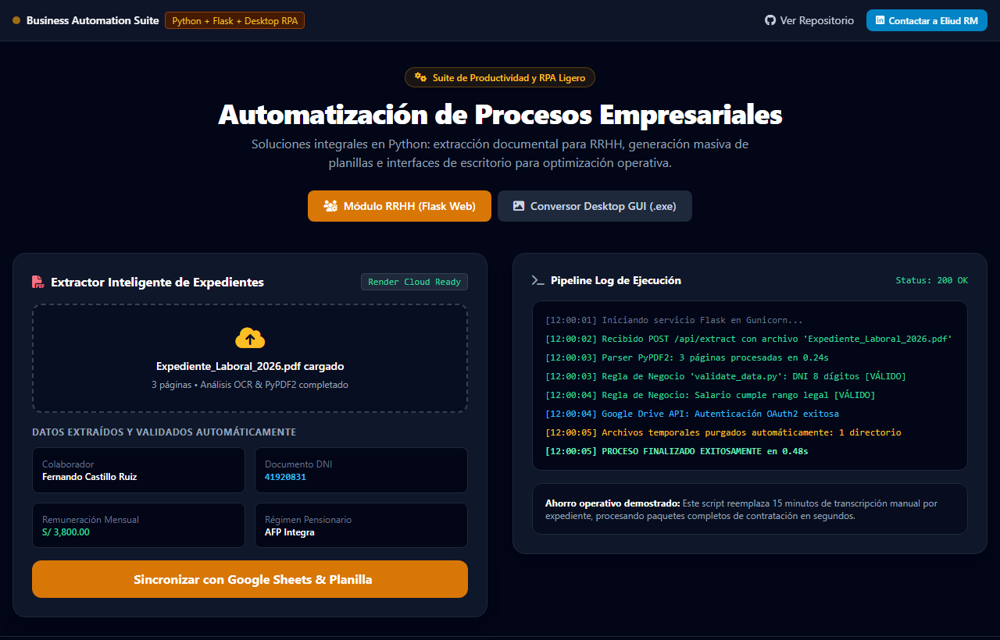
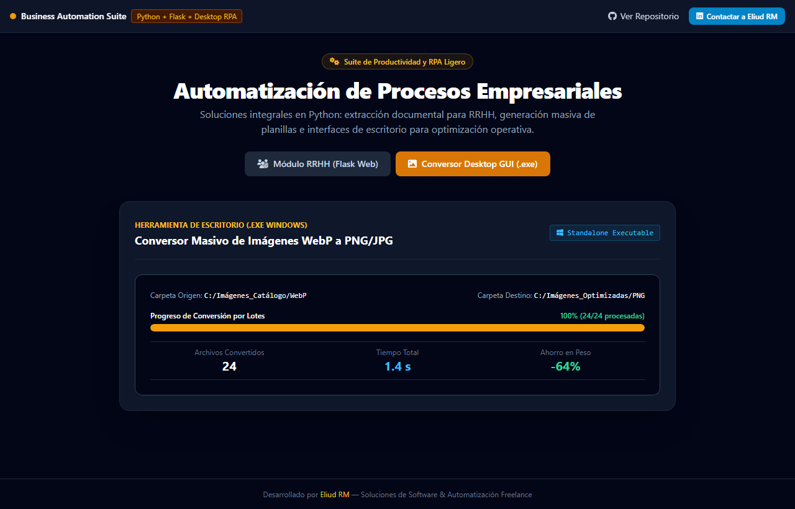

# ⚙️ Business Automation Suite — Automatización de Procesos Empresariales (Python / Flask / RPA)
> **Suite integral de herramientas y microaplicaciones para automatización de Recursos Humanos, procesamiento masivo de documentos Word/Excel y utilidades de productividad.**

  
  

  
  

---

## 📌 El Desafío de Negocio

En empresas medianas y departamentos operativos, el trabajo diario está saturado de tareas repetitivas de bajo valor que consumen el tiempo del equipo:
- **Carga de Datos Manual en Recursos Humanos**: Extraer información de expedientes PDF y tipear cada dato en planillas internas de control toma decenas de horas semanales y genera errores frecuentes.
- **Generación Repetitiva de Formatos**: Crear oficios combinando plantillas Word con bases de datos Excel sin un sistema ágil conduce a pérdidas de tiempo.
- **Cuellos de Botella en Archivos Gráficos**: Convertir manualmente cientos de imágenes WebP a PNG/JPG ralentiza los flujos de marketing y diseño.

---

## 💡 La Solución Implementada

**Business Automation Suite** agrupa soluciones modulares de software orientadas a erradicar el trabajo manual:

1. **Sistema Web de Automatización para RRHH (`Automatizacion/Web/Automatizar_RH`)**:
   - Aplicación Flask cloud-ready (Render).
   - Extracción inteligente de datos de PDF, validación de reglas de negocio y carga automática en Google Sheets.
2. **Motor de Reemplazo Masivo Word-Excel (`Automatizacion/Reemplazar_formato`)**:
   - Generación instantánea de formatos por lotes.
3. **Suite Desktop para Conversión Masiva de Imágenes (`Conversor_Imagenes`)**:
   - Ejecutable compilado (.exe) para Windows que procesa imágenes por lotes con 64% de ahorro en peso.

👉 **[Prueba la Demo Interactiva en Vivo aquí](https://enybyy.github.io/business-automation-suite/)**

---

## 📈 Impacto y Mejoras Conseguidas

| Proceso Automatizado | Operación Manual Previa | Con Business Automation Suite | Impacto Directo |
|---|---|---|---|
| **Procesamiento de Documentos RRHH** | 10 a 15 minutos por expediente | Menos de 30 segundos | **Ahorro de más de 25 horas hombre por semana** |
| **Generación de Formatos Word/Excel** | Tipeo manual documento por documento | Generación por lotes automatizada | **Reducción de errores humanos a 0%** |
| **Conversión Masiva de Imágenes** | Conversión una a una en páginas web | Procesamiento en bloque local en 1 clic | **Optimización del flujo de trabajo multimedia** |
| **Despliegue Cloud** | Scripts aislados | Aplicaciones web cloud-ready en Render | **Acceso centralizado para todo el equipo** |

---

## 🛠️ Stack Tecnológico

- **Backend**: Python 3, Flask, Jinja2 Templates.
- **Procesamiento Documental**: Pandas, OpenPyXL, python-docx, PyPDF2, Pillow.
- **Cloud & DevOps**: Render, Gunicorn, Procfile.
- **Desktop**: Tkinter GUI compilado con PyInstaller.

---

## 📬 ¿Tienes procesos manuales que están frenando a tu equipo?

Diseño y construyo **automatizaciones de procesos (RPA ligero), scripts de integración entre Excel, Word, PDFs y APIs, y aplicaciones web a medida**.

- **LinkedIn**: [Eliud RM](https://www.linkedin.com/in/eliud-rojas-mendoza-414652212/)
- **GitHub**: [@Enybyy](https://github.com/Enybyy)
- *Disponible para proyectos freelance y consultoría tecnológica.*
